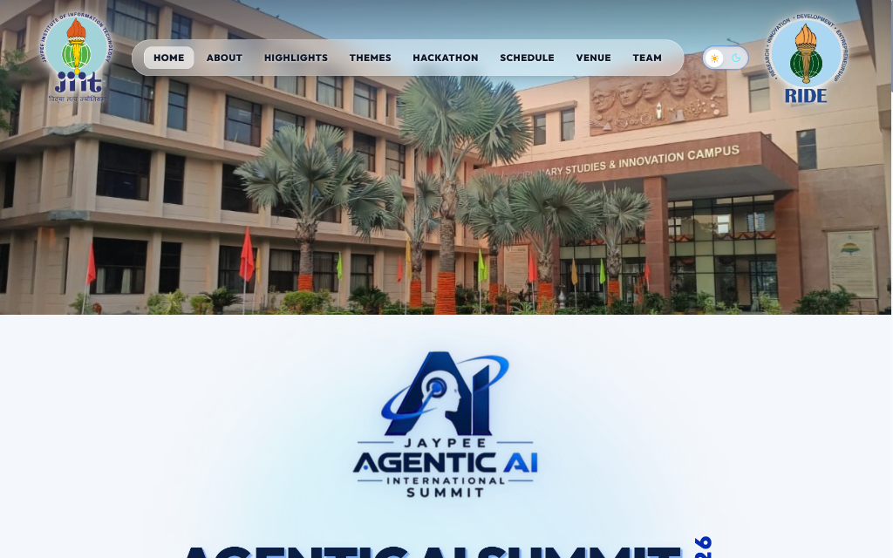
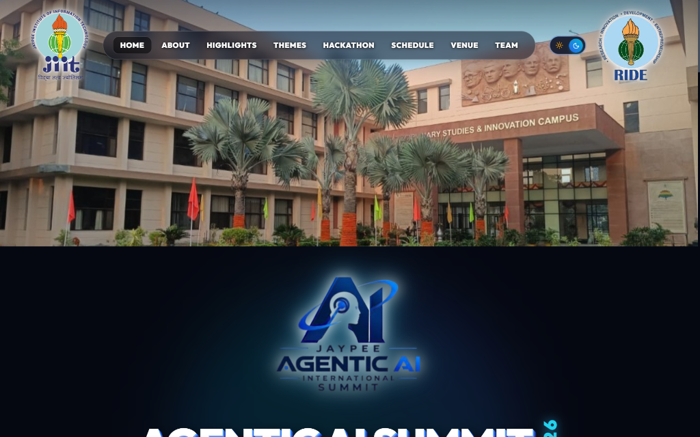
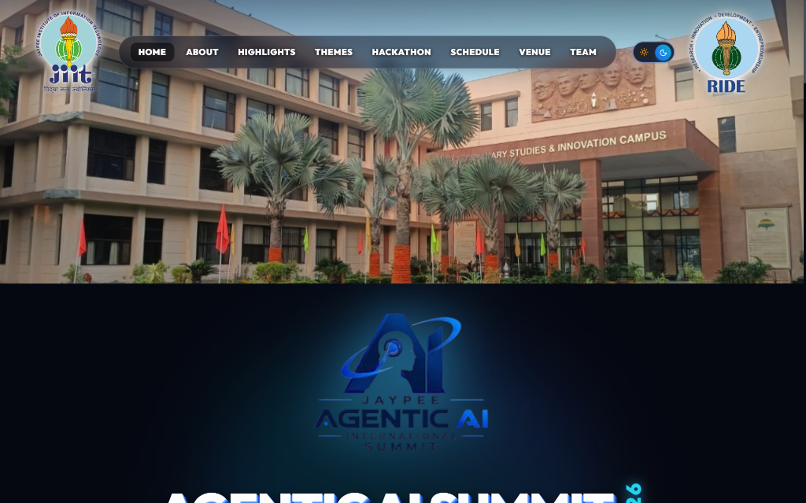
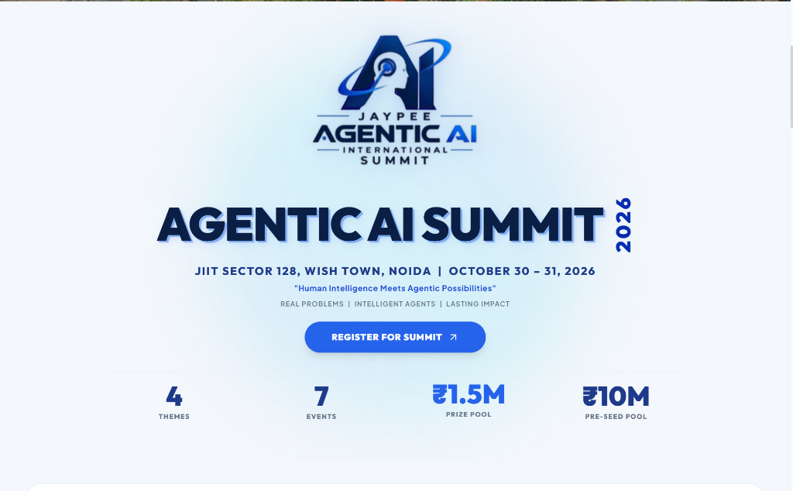
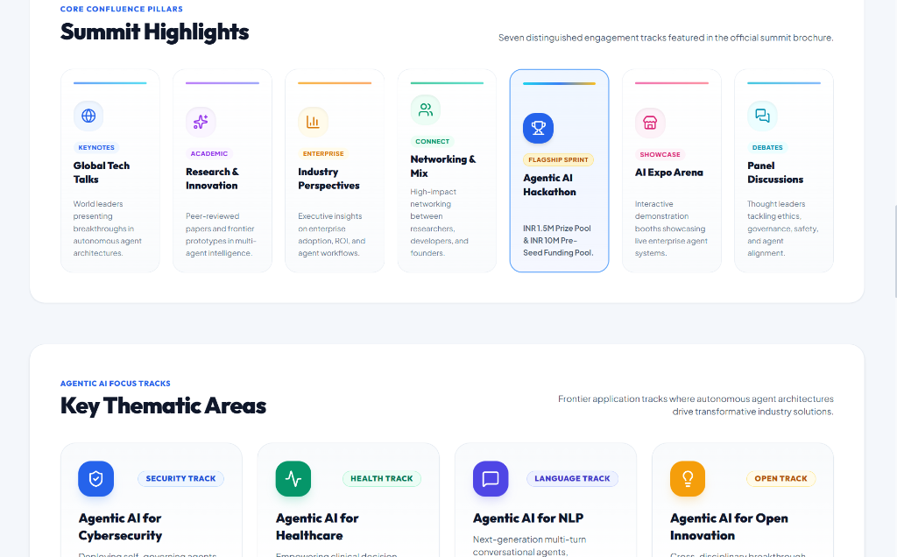

# Jaypee Agentic AI International Summit (JAI 2026)

Official web portal for the **Jaypee Agentic AI International Summit (JAI 2026)** hosted at the **Jaypee Institute of Information Technology (JIIT)**, Wish Town Campus, Sector-128, Noida on **October 30 – 31, 2026**.

> *"Human Intelligence Meets Agentic Possibilities"*  
> **Real Problems | Intelligent Agents | Lasting Impact**

---

## 📸 Interface Preview

### 1. Full-Width Campus Hero Banner & Header (Light Mode)


### 2. Full-Width Campus Hero Banner & Header (Dark Mode)


### 3. Centerpiece Agentic AI Logo & 3D Typography (Dark Mode)


### 4. Interactive Metric Ticker & Registration (Light Mode)


### 5. Summit Highlights & Key Thematic Areas


---

## ✨ Key Features & Enhancements

- 🏛️ **Full-Width Campus Banner**: Full-bleed rectangular photo of JIIT Sector-128 campus spanning 100% of device width with zero side letterboxing.
- 💎 **Overlay Transparent Navbar**: Frosted glass navigation bar floating directly across the sky portion of the campus banner with high-contrast bold typography.
- 🌟 **Enlarged Official Branding Logos**: Transparent JIIT and RIDE logos with contour drop shadows (`logo-clean-drop`), ensuring 100% legibility in both light and dark modes without artificial background boxes.
- 🌓 **Dual Light & Dark Theme**: 
  - **Light Theme**: White and Agentic Blue with toned-down, clean minimal 3D translucent accents.
  - **Dark Theme**: Deep obsidian black (`#050811`) with glowing cyber blue & cyan highlights.
  - **Seamless Capsule Switch**: Smooth sliding toggle switch with animated SVG Sun and Moon indicators and `localStorage` persistence.
- 🏆 **Agentic AI Hackathon Spotlight**: Flagship sprint backed by an **INR 1.5 Million Prize Pool** and an **INR 10 Million Pre-Seed Funding Pool** powered by RIDE.
- 🎯 **7 Core Confluence Pillars**:
  1. Global Tech Talks
  2. Research & Innovation
  3. Industry Perspectives
  4. Networking & Collaboration
  5. Agentic AI Hackathon
  6. AI Expo Arena
  7. Panel Discussions
- 🔬 **4 Key Thematic Areas**:
  1. Agentic AI for Cybersecurity
  2. Agentic AI for Healthcare
  3. Agentic AI for Natural Language Processing
  4. Agentic AI for Open Innovation
- 👥 **Dedicated Faculty Organizing Committee Webpage**:
  - Independent view accessible via `#team` or the navigation bar.
  - Full leadership hierarchy: Organizing Chair, Organizing Co-Chair, Functional Head.
  - 9 specialized faculty committees: Design & PR, Registration, Technical, Leadership Outreach, Roundtable Planning, Panel Discussion & Expert Talks, Expo, Hospitality, and Logistic.
  - Interactive search bar and committee filter pills.
  - Smart fallback initials avatars until photos are uploaded.
  - 1-click filename copy buttons and built-in photo upload reference guide.
- 📅 **Tentative Summit Schedule**: Dual-day structured outline for Day 1 (Oct 30) and Day 2 (Oct 31).
- 📍 **Venue & Directions**: Wish Town Campus Sector-128 Noida address with interactive Google Maps embed.

---

## 🛠️ Tech Stack

- **Framework**: React 18 (SPA with Hash Routing)
- **Bundler & Dev Server**: Vite 5
- **Styling**: Tailwind CSS 3 (with custom class-based dark mode & typography)
- **Icons**: Lucide React
- **Typography**: Outfit, Plus Jakarta Sans, Poppins

---

## 🚀 Getting Started

### Prerequisites
- [Node.js](https://nodejs.org/) (v18 or higher recommended)
- `npm`

### Installation
```bash
# Clone the repository
git clone https://github.com/madhavgairola/jai-summit.git

# Navigate into the project directory
cd jai-summit

# Install dependencies
npm install
```

### Running Locally
```bash
npm run dev
```
Open your browser and navigate to:
**[http://localhost:3000](http://localhost:3000)**

### Production Build
```bash
npm run build
```
The compiled assets will be output to the `dist/` directory.

### Preview Production Build
```bash
npm run preview
```

---

## 📷 Faculty Photo Upload Guide

Faculty member profile pictures can be dropped into:
```
public/imgs/team/[filename].jpg
```

| Committee / Role | Name | Expected Filename |
| :--- | :--- | :--- |
| **Organizing Chair** | Prof. Mukesh Saraswat | `mukesh-saraswat.jpg` |
| **Organizing Co-Chair** | Dr. Himani Bansal | `himani-bansal.jpg` |
| **Functional Head** | Dr. Vinay Anand Tikkiwal | `vinay-tikkiwal.jpg` |
| **Design and PR (Lead)** | Aakriti Bhardwaj | `aakriti-bhardwaj.jpg` |
| **Design and PR** | Aparna Arya | `aparna-arya.jpg` |
| **Design and PR** | Shagun Gupta | `shagun-gupta.jpg` |
| **Registration (Lead)** | Piyush Sharma | `piyush-sharma.jpg` |
| **Registration** | Niraj Kumar | `niraj-kumar.jpg` |
| **Technical (Lead - Planning)** | Akanksha Mehndiratta | `akanksha-mehndiratta.jpg` |
| **Technical (Lead - Execution)** | Sandeep Raj | `sandeep-raj.jpg` |
| **Technical** | Ruchika Bala | `ruchika-bala.jpg` |
| **Technical** | Akanksha Singh | `akanksha-singh.jpg` |
| **Technical** | Meenu Shukla | `meenu-shukla.jpg` |
| **Technical** | Neeraj Pathak | `neeraj-pathak.jpg` |
| **Technical** | Noor Mohammad | `noor-mohammad.jpg` |
| **Technical** | Santosh Ray | `santosh-ray.jpg` |
| **Technical** | Jiddu Krishnan O P | `jiddu-krishnan-op.jpg` |
| **Technical** | Piyush Kushwaha | `piyush-kushwaha.jpg` |
| **Technical** | Santosh Kumar | `santosh-kumar.jpg` |
| **Leadership Outreach (Lead)** | Sajai Vir Singh | `sajai-vir-singh.jpg` |
| **Leadership Outreach** | Ankur Gupta | `ankur-gupta.jpg` |
| **Leadership Outreach** | Ila Naqvi | `ila-naqvi.jpg` |
| **Leadership Outreach** | Rajshree Singh | `rajshree-singh.jpg` |
| **Leadership Outreach** | Vaibhav Sharma | `vaibhav-sharma.jpg` |
| **Roundtable Planning (Lead)** | Divya Kaushik | `divya-kaushik.jpg` |
| **Roundtable Planning** | Kumar Mohit | `kumar-mohit.jpg` |
| **Roundtable Planning** | Deepti Singh | `deepti-singh.jpg` |
| **Panel & Talks (Lead)** | Anubhuti Roda Mohindra | `anubhuti-roda-mohindra.jpg` |
| **Panel & Talks** | Aditi Sharma | `aditi-sharma.jpg` |
| **Panel & Talks** | Lakhveer Kaur | `lakhveer-kaur.jpg` |
| **Panel & Talks** | Madhav Bansal | `madhav-bansal.jpg` |
| **Expo (Lead)** | Amit Verma | `amit-verma.jpg` |
| **Expo** | Bhartendu Chaturvedi | `bhartendu-chaturvedi.jpg` |
| **Expo** | Amita Bhagat | `amita-bhagat.jpg` |
| **Expo** | Harish Bishwakarma | `harish-bishwakarma.jpg` |
| **Expo** | Minal Tandekar | `minal-tandekar.jpg` |
| **Expo** | Rishabh Negi | `rishabh-negi.jpg` |
| **Hospitality (Lead)** | Himanshu Agrawal | `himanshu-agrawal.jpg` |
| **Hospitality** | Jyoti Rani | `jyoti-rani.jpg` |
| **Logistic (Lead)** | Praveen Kumar Sharma | `praveen-kumar-sharma.jpg` |
| **Logistic** | Ankit Kumar Saini | `ankit-kumar-saini.jpg` |
| **Logistic** | Gaurav Sinha | `gaurav-sinha.jpg` |
| **Logistic** | Ravi Prakash Verma | `ravi-prakash-verma.jpg` |

*(If any image is not yet uploaded, a stylized gradient avatar with member initials is rendered automatically).*

---

## 🏛️ Event Coordinates

- **Venue**: Jaypee Institute of Information Technology (JIIT), Wish Town Campus, Sector-128, Noida, Uttar Pradesh 201304, India
- **Dates**: October 30 – 31, 2026
- **Registration**: [Official Summit Google Form](https://forms.gle/E1x9CT8mF5z1R4YC8)

---

## 📄 License

© 2026 Jaypee Agentic AI International Summit. All rights reserved.
Organized in collaboration with Jaypee Institute of Information Technology and the RIDE initiative.
